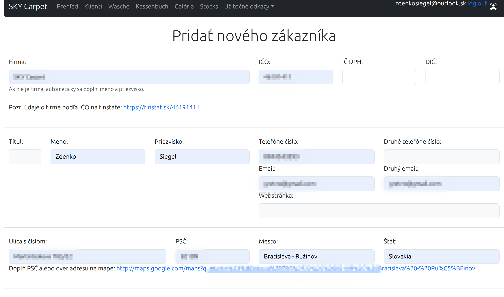
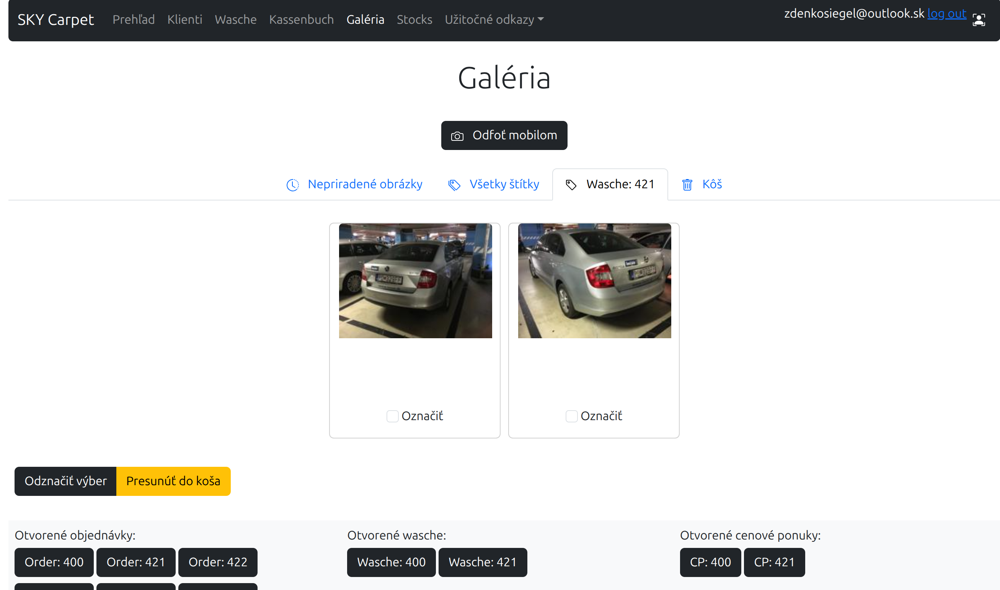

# PythonPortfolio
Projekty kódované v pythone

## xml

- Tvorba custom xml feedu pre merchant center z csv súboru
- Keďže upgates.cz vytváral nedostatočný xml feed, som pristúpil k custom riešeniu
- V súčastnosti je manuálne python kód spúšťaný podľa potreby, v pláne je ho umiestniť na aws - ec2 (doker)

## django

- Pre potreby firmy a nespokojnosti s riešením VBA excel objednávkami (vibe coding v 2023 - modulárne okno s verifikáciou a spracovaním údajov).
- Biznis bootstrap design aplikovaný na aplikácie
- __app__ customer_import
  - Pomocou jupiterstudio vyčistené csv údaje z idoklad.sk (odstránenie duplicít, atď...)
  - Import pomocou pandas do model app customer
- __app__ customer
  - Zoznam klientov s podrobnosťami o klientovi
  - Pridanie odstránenie klientov
  - Vyhľadávanie klientov, filtrovanie klientov podľa abecedy

- __app__ fotografie
  - Upload fotografií (možnosť na mobile spraviť buttonom fotografiu)
  - Štítkovanie fotografií tagmi
  - Organizácia fotografií do priečinkov na základ pridelených tagov

- __app__ values
  - Navrhnuté ako settings pre django aplikáciu, inšpirované visual studio settings
  - Volanie modulu s funkciou ktorá k požadovanej variabilnej hodnote načíta priradenú variabilnú hodnotu
  - Hodnoty sú vytvárané a ukladajú do json formátu do modelu
  - Hodnoty môžu mať rozličné typy údajov (txt, int, email, atď...)
- __app__ wesche objednávky
  - Slúži ako objednávkový systém čistenia a opravy kobercov a s tým spojenými službami
  - Zoznam objednávok
  - Zoznam kobercov v objednávke
  - Procedúry aplikované na koberce pri čistene a oprave
  - Prepracované custom formuláre
  - aplikácia je rozpracovaná, teraz pripravujem css @media print pre tlač objednávok

- __app__ synchro sklad
  - Na požiadavku dodávateľské feedy stiahnuté 2x z FTP, 1x z emailu
  - Do databázy ukladané EAN kódy s časovou značkou a dostupnosťou,.
  - Údaj je ukladaný len ak je zmena v skladovej dostupnosti
  - Pre väčší výkon je indexovaný EAN kód
  - Pridávanie položiek na základe csv súboru
  - Tvorba csv s aktuálnou skladovou dostupnosťou, a dodacou lehotou pre upgates.cz
- finesy
  - Štandardne django umiestňuje konfigurácie aplikácie do priečinku s rovnakým názvom, ako je názov aplikácie, pre nespokojnosť bol premenovaný na settings, čo si vyžiadalo úpravy v konfigurácií django aplikáie
  - Django seasons použitý na prenos variabilných hodnôt medzi jednotlivými appkami (id klienta z app customers do app objedávka)
  - Custom user a použitie @login_required pre obmedzenie prístupu k funkciám
- plány
  - Po dokončení wasche nasadenie na AWS EC2 (docker)
  - Tvorba skladu predajne pre zvýšenie efektivity
  - Objednávky od klienta k dodávateľovi
  - Pokladňa a fakturácia
  - CRM
